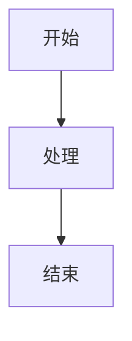

# Mermaid 图表生成器 (Mermaid Visualizer)

将文本内容转换为专业的 Mermaid 图表，适用于演示文稿和文档。

## 功能

- 自动分析内容，选择合适的图表类型
- 内置语法错误预防机制
- 支持多种图表类型
- 兼容 Obsidian、GitHub 等平台

## 支持的图表类型

| 类型 | 用途 |
|------|------|
| 流程图 (flowchart) | 流程、步骤、决策 |
| 时序图 (sequence) | 交互、通信过程 |
| 类图 (class) | 代码结构、关系 |
| 状态图 (state) | 状态转换 |
| 甘特图 (gantt) | 项目计划、时间线 |
| 思维导图 (mindmap) | 概念组织、头脑风暴 |

## 使用方法

在 Claude Code 中说：
- "画一个流程图"
- "用 Mermaid 可视化这个架构"
- "生成时序图"

## 输出

## 作者

[@chaye7417](https://github.com/chaye7417)

## 许可证

MIT
