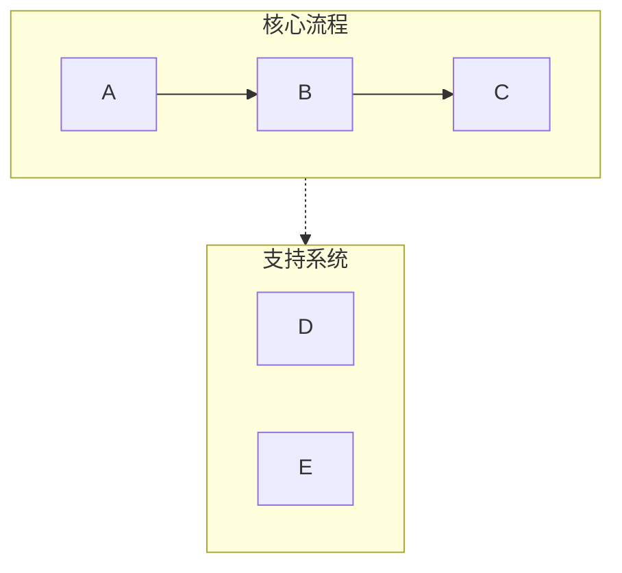
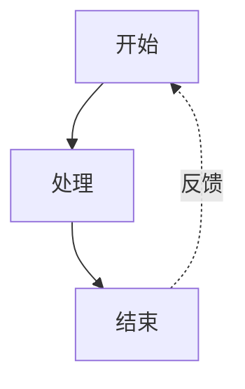
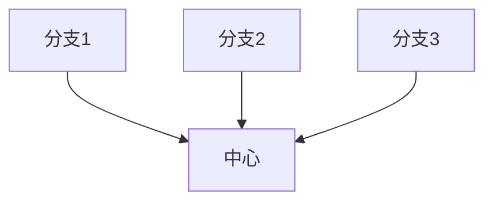

# Mermaid 可视化器

## 概述

将文本内容转换为简洁、专业的 Mermaid 图表，针对演示文稿和文档进行优化。自动处理常见的语法陷阱（列表语法冲突、子图命名、间距问题），确保图表在 Obsidian、GitHub 和其他 Mermaid 兼容平台上正确渲染。

## 快速入门

创建 Mermaid 图表时：

1. **分析内容** - 识别关键概念、关系和流程
2. **选择图表类型** - 选择最合适的可视化方式（见下方图表类型）
3. **选择配置** - 确定布局、详细程度和样式
4. **生成图表** - 创建语法正确的 Mermaid 代码
5. **输出为 Markdown** - 用正确的代码块包装，可选添加说明

**默认假设：**
- 垂直布局（TB），除非要求水平布局
- 中等详细程度（在简洁和信息量之间平衡）
- 使用语义颜色的专业配色方案
- 兼容 Obsidian/GitHub 的语法

## 图表类型

### 1. 流程图 (graph TB/LR)
**适用于：** 工作流、决策树、顺序流程、AI 智能体架构

**使用场景：** 内容描述步骤、阶段或操作序列

**关键特性：**
- 通过 subgraph 实现泳道分组
- 箭头标签用于转换说明
- 反馈循环和分支
- 颜色编码的阶段

### 2. 循环流程图 (graph TD 带循环布局)
**适用于：** 循环流程、持续改进循环、智能体反馈系统

**使用场景：** 内容强调迭代、反馈或循环关系

### 3. 对比图 (graph TB 带并行路径)
**适用于：** 前后对比、A vs B 分析、传统 vs 现代系统

**使用场景：** 内容对比两种或多种方法或系统

### 4. 思维导图
**适用于：** 层级概念、知识组织、主题细分

**使用场景：** 内容具有清晰的父子层级关系

### 5. 时序图
**适用于：** 组件间交互、API 调用、消息流

**使用场景：** 内容涉及参与者/系统随时间的通信

### 6. 状态图
**适用于：** 系统状态、状态转换、生命周期阶段

**使用场景：** 内容描述状态及其转换

## 关键语法规则

**始终遵循这些规则以防止解析错误：**

### 规则 1：避免列表语法冲突
```
❌ 错误: [1. 感知]       → 触发 "Unsupported markdown: list"
✅ 正确: [1.感知]         → 删除句号后的空格
✅ 正确: [① 感知]         → 使用带圈数字 (①②③④⑤⑥⑦⑧⑨⑩)
✅ 正确: [(1) 感知]       → 使用括号
✅ 正确: [步骤1: 感知]   → 使用"步骤"前缀
```

### 规则 2：子图命名
```
❌ 错误: subgraph AI Agent Core  → 名称中有空格但没有引号
✅ 正确: subgraph agent["AI Agent Core"]  → 使用 ID 配合显示名称
✅ 正确: subgraph agent          → 仅使用简单 ID
```

### 规则 3：节点引用
```
❌ 错误: Title --> AI Agent Core  → 直接引用显示名称
✅ 正确: Title --> agent          → 引用子图 ID
```

### 规则 4：节点文本中的特殊字符
```
✅ 对带空格的文本使用引号: ["带空格的文本"]
✅ 转义或避免: 引号 → 使用『』代替
✅ 转义或避免: 括号 → 使用「」代替
✅ 圆形节点中的换行: ((文本<br/>换行))
```

### 规则 5：箭头类型
- `-->` 实线箭头
- `-.->` 虚线箭头（用于支持系统、可选路径）
- `==>` 粗箭头（用于强调）
- `~~~` 不可见连接（仅用于布局）

## 配置选项

所有图表接受以下参数：

**布局：**
- `direction`: "vertical" (TB), "horizontal" (LR), "right-to-left" (RL), "bottom-to-top" (BT)
- `aspect`: "portrait"（默认）, "landscape"（宽）, "square"

**详细程度：**
- `simple`: 仅核心元素，最少标签
- `standard`: 平衡的详细程度，包含关键描述（默认）
- `detailed`: 完整注释、说明和元数据
- `presentation`: 针对幻灯片优化（更大文字，更少细节）

**样式：**
- `minimal`: 单色，简洁线条
- `professional`: 语义颜色，清晰层级（默认）
- `colorful`: 鲜艳颜色，高对比度
- `academic`: 正式样式，用于论文/文档

## 工作流程

1. **理解内容**
   - 识别主要概念、实体和关系
   - 确定层级或顺序
   - 注意任何对比或比较

2. **选择图表类型**
   - 将内容结构匹配到图表类型
   - 考虑用户的演示场景
   - 如果不确定，默认使用流程图

3. **选择配置**
   - 应用用户指定的选项
   - 对未指定的选项使用合理默认值
   - 优化可读性

4. **生成 Mermaid 代码**
   - 严格遵循所有语法规则
   - 使用语义命名（描述性 ID）
   - 应用一致的样式
   - 检查常见错误：
     * 节点文本中无"数字. 空格"模式
     * 所有子图使用 ID["显示名称"] 格式
     * 所有节点引用使用 ID 而非显示名称

5. **输出带上下文**
   - 用 ```mermaid 代码块包装
   - 添加图表结构的简要说明
   - 提及渲染兼容性（Obsidian、GitHub 等）
   - 提供调整或创建变体的选项

## 默认配色方案

标准专业调色板：
- 绿色 (#d3f9d8/#2f9e44): 输入、感知、起始状态
- 红色 (#ffe3e3/#c92a2a): 规划、决策点
- 紫色 (#e5dbff/#5f3dc4): 处理、推理
- 橙色 (#ffe8cc/#d9480f): 操作、工具使用
- 青色 (#c5f6fa/#0c8599): 输出、执行、结果
- 黄色 (#fff4e6/#e67700): 存储、记忆、数据
- 粉色 (#f3d9fa/#862e9c): 学习、优化
- 蓝色 (#e7f5ff/#1971c2): 元数据、定义、标题
- 灰色 (#f8f9fa/#868e96): 中性元素、传统系统

## 常见模式

### 泳道模式（分组）


### 反馈循环模式


### 中心辐射模式


## 质量检查清单

输出前验证：
- [ ] 节点文本中无"数字. 空格"模式
- [ ] 所有子图使用正确的 ID 语法
- [ ] 所有箭头使用正确语法 (-->, -.->)
- [ ] 颜色应用一致
- [ ] 指定了布局方向
- [ ] 存在样式声明
- [ ] 无模糊的节点引用
- [ ] 兼容 Obsidian/GitHub 渲染器
